This guide walks through how to create, configure, test, and publish an eligibility screener using Benefit Decision Toolkit (BDT).

---

## 1. Screeners

After signing in, you will land on the **Screeners** view. This page displays all of your existing screeners and serves as your starting point for creating and managing screeners.

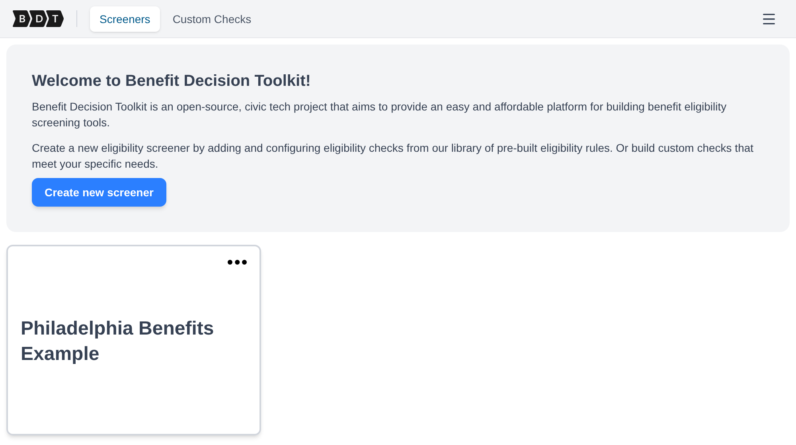

New accounts start with the **Philadelphia Benefits Example** screener. It screens for three Philadelphia tax benefits from the BDT library and **Philly Cash**, a fictional benefit built from custom checks. The screenshots in this guide come from that example, so you can open it in your own account and follow along.

From here, you can:

- View all of your existing screeners
- Open and edit a screener
- Create a new screener
- Import a screener shared by another analyst

**Creating a new screener**:

Select **Create new screener** and provide a name for your screener. The name should clearly reflect the benefit or set of benefits being screened (for example, "Philadelphia Senior Benefits" or "Housing Assistance Eligibility").

After the screener is created, you are automatically taken to the **Screener Dashboard**.

### Sharing a screener

Save your changes, then return to **Screeners**, open the menu on the screener's card, and select **Export screener**. BDT downloads one `.bdt.json` file containing the saved benefits, configured check versions, parameters, aliases, custom-check rules and drafts, and form. Share this file with the recipient.

To open a shared screener, select **Import screener** on the **Screeners** page, choose the JSON file (up to 10 MB), and review the prefilled **Screener name**. If that name already exists in your account, choose a different name before selecting **Import screener** in the dialog. Screener names are unique within your account, ignoring case and surrounding spaces. BDT opens a new editable draft owned by your account. You can preview, edit, and publish it with its own public URL.

Each import creates independent copies of the custom checks. If a custom check's name and module already exist in your account, the copy goes into a module with an `imported` suffix. The screener keeps the check versions used by the sender. Library checks use your BDT server's library and must be available there; a file with missing checks is rejected before anything is imported.

---

## 2. The Screener Dashboard

When you open a screener, you are taken to the **Screener Dashboard** — the central workspace for building and managing your screener.

At the top of the page, the navigation bar contains four tabs representing the main stages of screener development:

- **Manage Benefits** — define the eligibility logic for each benefit your screener evaluates
- **Form Editor** — build the user-facing form that collects applicant information
- **Preview** — test the screener end-to-end before publishing
- **Publish** — deploy your screener to a public URL

Work through these tabs in order when building a screener for the first time. The eligibility logic you define in **Manage Benefits** informs what inputs the **Form Editor** needs to collect, and both must be complete before **Preview** and **Publish** are meaningful.

---

## 3. Defining Eligibility Logic (Manage Benefits)

The **Manage Benefits** tab is where you define the eligibility logic used by your screener.

In BDT, a **Benefit** is a named configuration that evaluates whether a user qualifies for a specific program. When a user submits the screener form:

1. BDT collects the user's inputs from the form.
2. Each configured Benefit evaluates those inputs against its eligibility rules.
3. Each Benefit returns an eligibility result.
4. The results are displayed to the user on the form's results screen.

A single screener can evaluate eligibility for one or multiple benefits. Each benefit's logic is defined independently, which allows a screener to assess users for several related programs while keeping the eligibility rules for each benefit separate and manageable.

### 3.1 Manage Benefits Overview

The **Manage Benefits** tab displays all benefits configured for your screener as a list of cards.

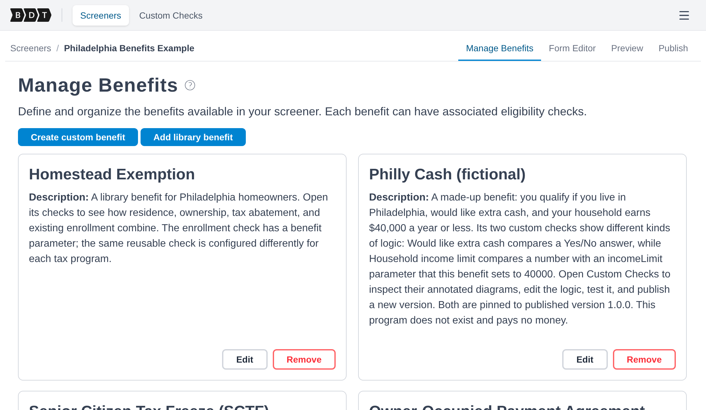

From this view, you can:

- **Create a custom benefit** by selecting **Create custom benefit** and providing a name and description
- **Add a library benefit** by selecting **Add library benefit**, choosing a pre-built benefit, and selecting **Add to screener**. The imported copy can then be edited without changing the library source.
- **Edit** a benefit by selecting **Edit** on its card, which opens the **Configure Benefit** page
- **Remove** a benefit by selecting **Remove** on its card

---

## 4. Configuring a Benefit

The **Configure Benefit** page is where you define the rules that determine whether a user qualifies for a specific benefit. You access it by selecting **Edit** on any benefit card.

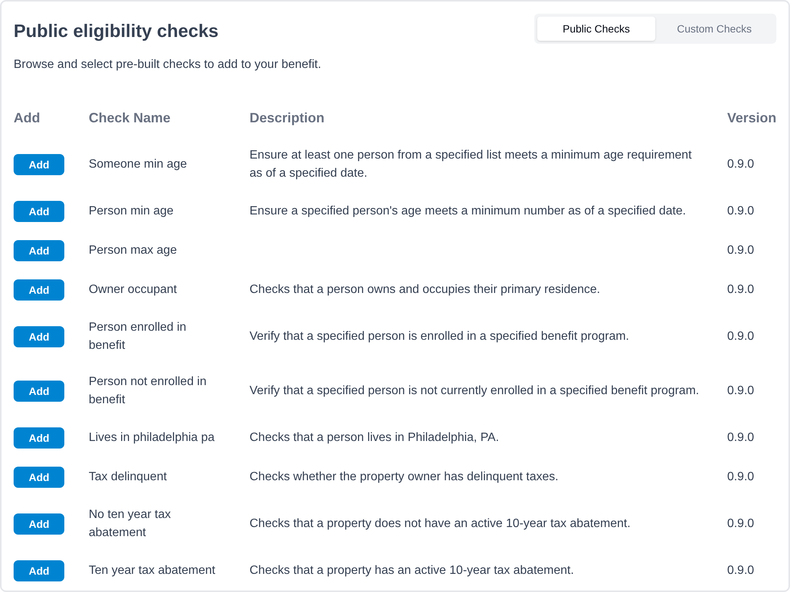

Each benefit contains one or more **Eligibility Checks**.

> A user is considered **eligible for the benefit only if every eligibility check evaluates to `True`.**

### 4.1 What Is an Eligibility Check?

An **Eligibility Check** is a reusable rule component that:

- Accepts one or more inputs (from the screener form or from configured parameters)
- Evaluates a defined condition
- Returns a boolean result (`True` or `False`)

By adding multiple eligibility checks to a benefit, you define the complete set of criteria a user must meet to qualify.

**Example**:

Suppose a benefit requires that applicants be at least 65 years old and live in the state of Pennsylvania. You could configure:

- A **Minimum Age** check with a minimum age parameter of `65`
- A **State of Residence** check with a state parameter of `Pennsylvania`

If **both** checks return `True`, the user is eligible for the benefit. If **either** check returns `False`, the user is not eligible.

### 4.2 Adding Eligibility Checks

The left side of the Configure Benefit page displays the list of available eligibility checks. Checks are organized into two categories:

- **Public Checks** — prebuilt checks available to all BDT users
- **Custom Checks** — custom checks that you have created and published

Each row in the list shows the check name, a brief description, and its version. Select **Add** on any row to add that check to the benefit.

If the check has no parameters, it is added right away. If it has parameters, a dialog opens so you can fill them in first (see [Configuring Check Parameters](#43-configuring-check-parameters)); select **Add check** to add it.

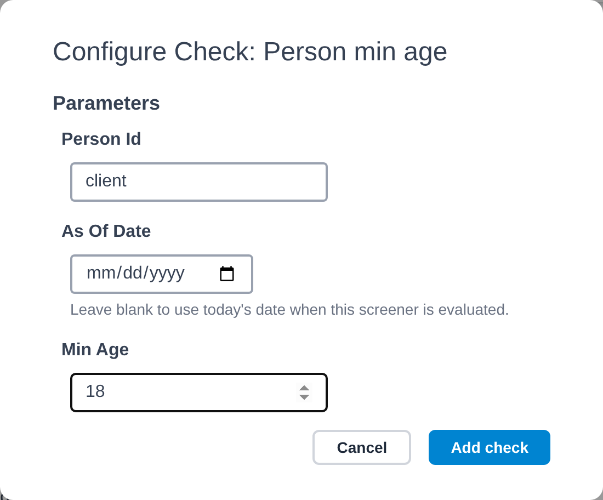

Once added, the check appears as a card in the right panel under the benefit's configured checks.

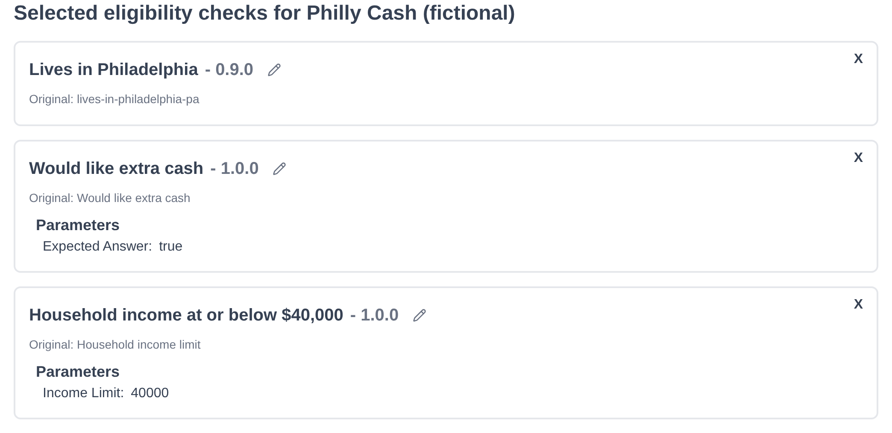

### 4.3 Configuring Check Parameters

Many eligibility checks have **parameters** — configurable values that control how the check evaluates eligibility. Parameters allow the same check logic to be reused across multiple benefits with different thresholds.

**Example**: The example screener's **Household income limit** custom check has an `incomeLimit` parameter. Philly Cash sets it to `40000`; another benefit could add the same check with a limit of `20000`. The underlying rule is the same; only the threshold differs. The [Custom Checks guide](/user/custom-checks/) shows how this check is built.

When you add a check that has parameters, the add-check dialog asks for them before the check is added. Fill in the value for each parameter and select **Add check**. Required parameters are marked with a red asterisk (`*`).

To change the parameters of a check you already added, click on its card in the right panel. The same form opens; update the values and select **Confirm** to save.

### 4.4 Removing a Check

To remove an eligibility check from a benefit, select the **X** button in the top-right corner of that check's card in the right panel.

---

## 5. Building the Form (Form Editor)

The **Form Editor** tab is where you build the user-facing form that collects the information needed to evaluate eligibility.

The editor provides a visual drag-and-drop canvas powered by Form-JS. You can add, arrange, and configure form fields without writing any code.

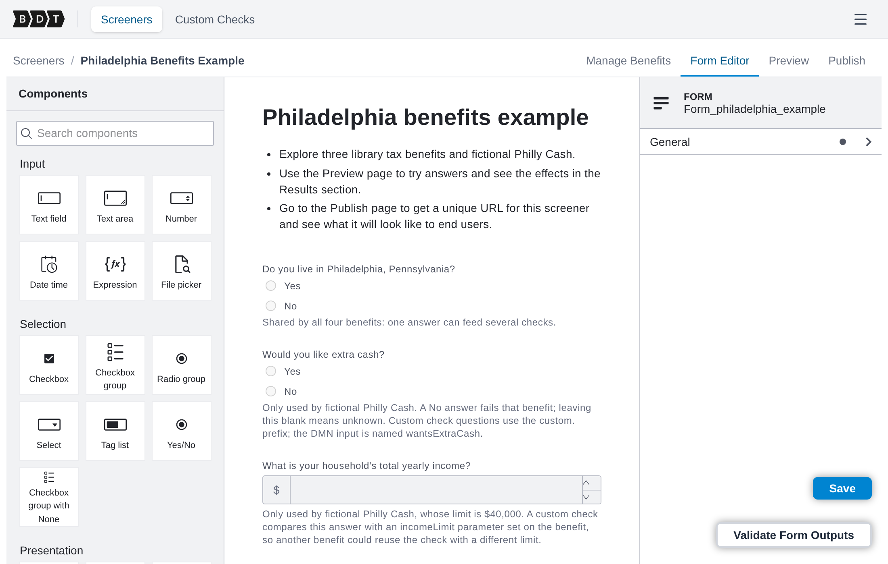

For questions where people can select several options or explicitly answer **None of these**, use **Checkbox group with None** from the Selection components. Configure its options using static values, input data, or an expression, and map its key to an array input. Until someone answers, the input is `null`; choosing **None of these** sends an empty array; choosing other options sends their selected values. **None of these** clears the other choices automatically.

A **Checkbox group** or **Tag list** with nothing selected also sends `null`, because an empty selection can't be told apart from an unanswered question. Use **Checkbox group with None** when people need to be able to answer that none apply.

**Saving your work**:

Select **Save** to persist your form. The save button turns yellow when there are unsaved changes, so you can tell at a glance whether your current edits have been saved.

### 5.1 Connecting Form Fields to Eligibility Checks

For the screener to evaluate eligibility correctly, the form must collect all of the inputs that the configured eligibility checks require. Each form field has a **key** that identifies the data it collects — this key must match the input name expected by the corresponding eligibility check.

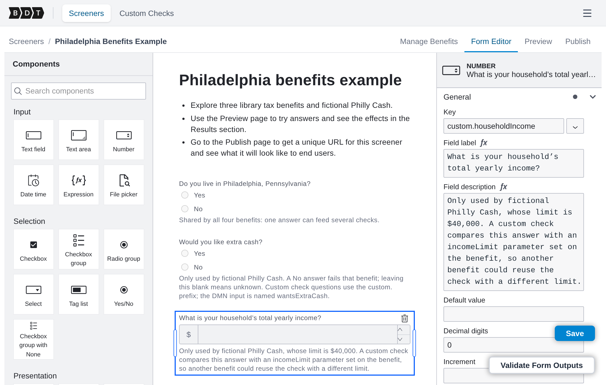

The **Validate Form Outputs** drawer (accessible via a button at the bottom-right of the editor) helps you verify that your form covers all required inputs. It shows:

- **Form Outputs** — a list of all fields currently defined in the form and the data they will collect
- **Missing Inputs** — inputs required by your eligibility checks that the form does not yet provide (shown in red)
- **Satisfied Inputs** — required inputs that are already covered by form fields (shown in green)

Use this drawer to identify gaps between your form and your eligibility logic, and resolve any missing inputs before moving to the Preview step.

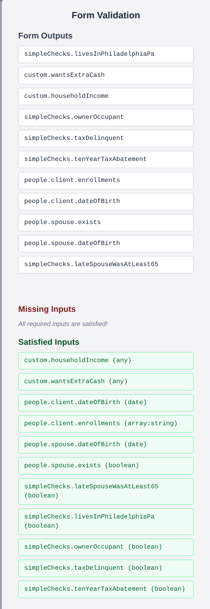

---

## 6. Previewing Your Screener

The **Preview** tab provides a live test environment where you can interact with your screener exactly as an end user would, and verify that the eligibility logic produces the correct results.

The preview screen is divided into two sections:

**Form section**:

Displays your screener form as it will appear to end users. Eligibility results update automatically as you answer the questions.

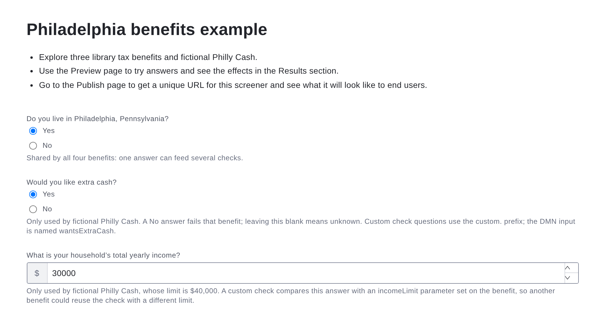

**Results section**:

After answering, the results section displays the outcome for each benefit:

- **Eligible** (green) — all eligibility checks for the benefit returned `True`
- **Ineligible** (red) — one or more eligibility checks returned `False`
- **Need more information** (yellow) — one or more checks could not determine eligibility from the inputs provided

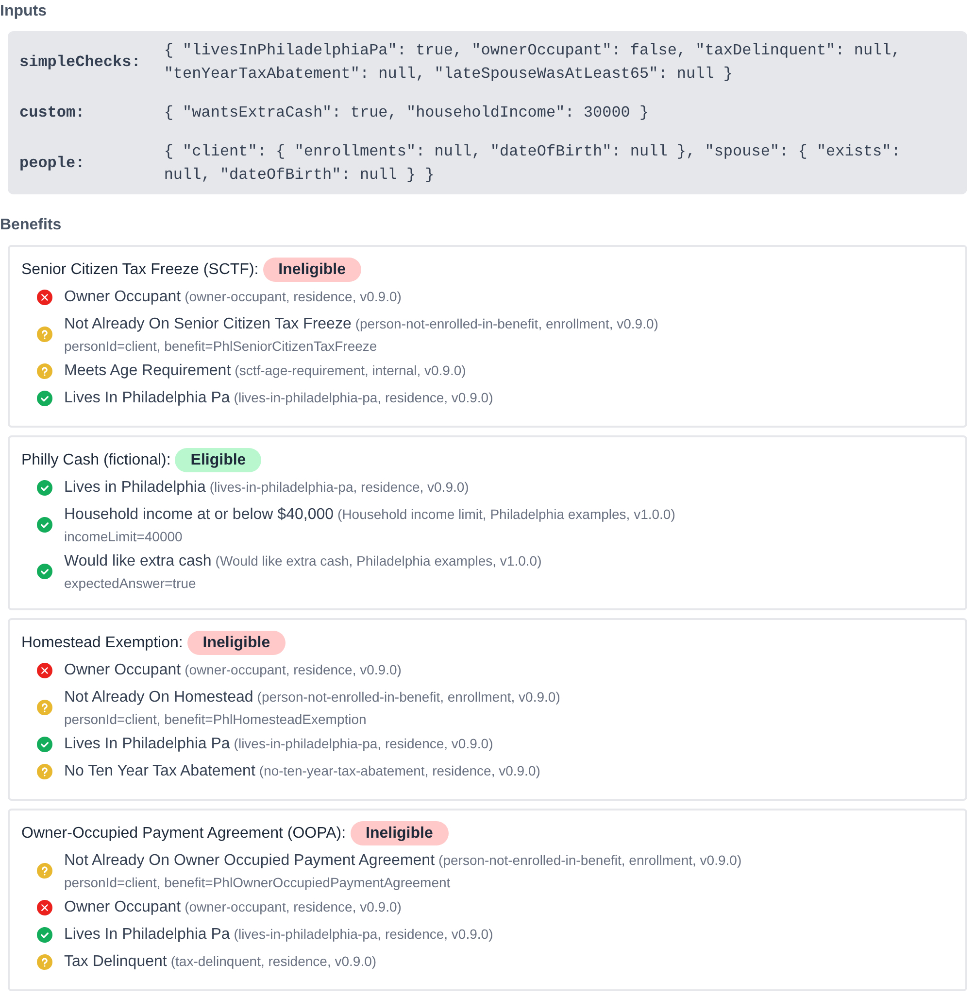

In the example above, the applicant lives in Philadelphia, would like extra cash, has a yearly income of $30,000, and does not own their home. Philly Cash is eligible; the three tax benefits are ineligible because their owner-occupant check fails. The example form's **Try a few scenarios** section suggests other answers to try.

Each benefit's result also shows a breakdown of how each individual eligibility check evaluated, including whether it passed, failed, or was unable to determine, and what parameter values were used. This detail is useful for debugging eligibility logic during development.

> Use the Preview tab iteratively as you build your screener to confirm that each benefit evaluates correctly across a range of test inputs.

After an evaluation, BDT may hide questions that no remaining benefit needs.
For example, if an answer makes a benefit ineligible, later questions used only
by that benefit no longer need to be answered. Use **Show all questions** to
review the complete form, and **Hide questions that aren't needed** to return
to the adaptive view.

---

## 7. Publishing Your Screener

The **Publish** tab is where you deploy your screener to a publicly accessible URL that you can share with end users.

**To publish your screener**:

Select **Publish Screener**. BDT will package your current form and eligibility logic and make them available at a public URL. The URL is displayed on the Publish tab after the first publication.

The Publish tab shows:

- **Screener URL** — the public link where end users can access and submit the screener
- **Last Published Date** — the date and time of the most recent deployment

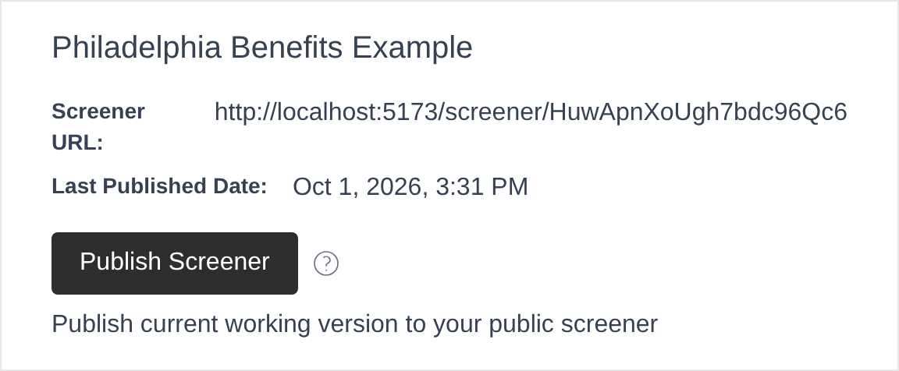

> Publishing your screener creates a snapshot of the current form and benefit configuration. Subsequent edits to the form or eligibility logic are not reflected at the public URL until you publish again.

If you update your screener after publishing, return to the **Publish** tab and select **Publish Screener** again to push the updated version to the public URL.

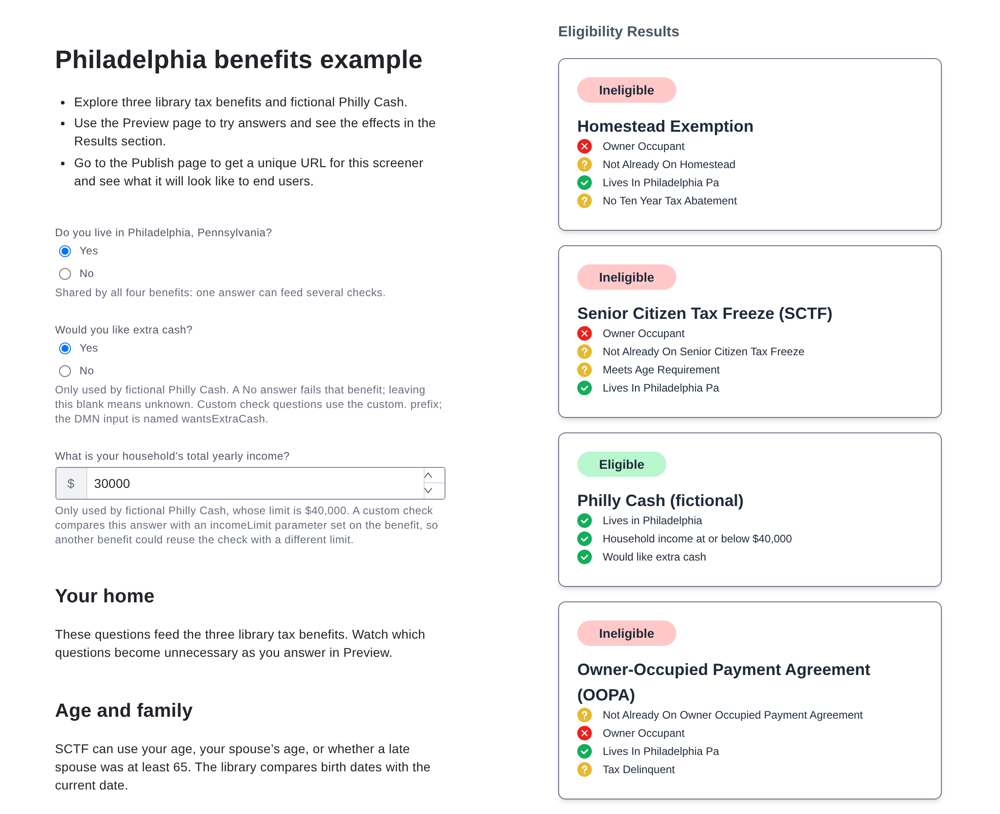
