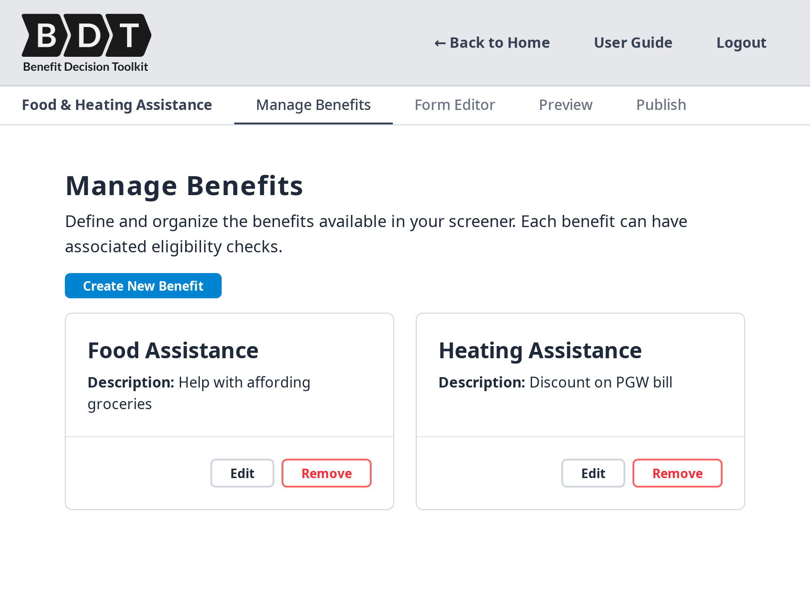

### Screener Builder

A toolkit designed to simplify and improve the proces of creating online screeners for public benefit eligibility.

<a href="https://github.com/CodeForPhilly/benefit-decision-toolkit" target="_blank">Visit GitHub repository ↗</a>
